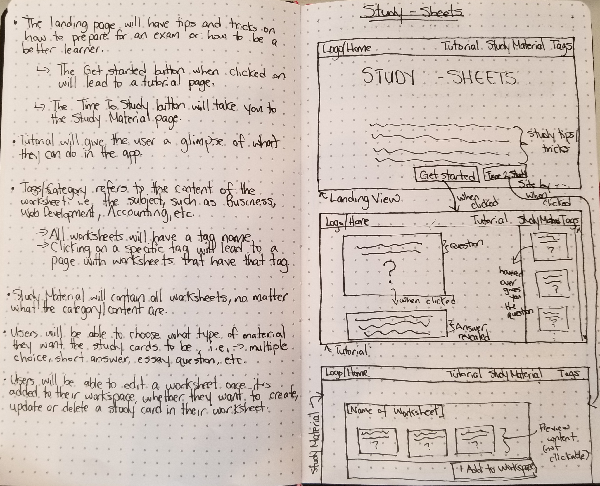
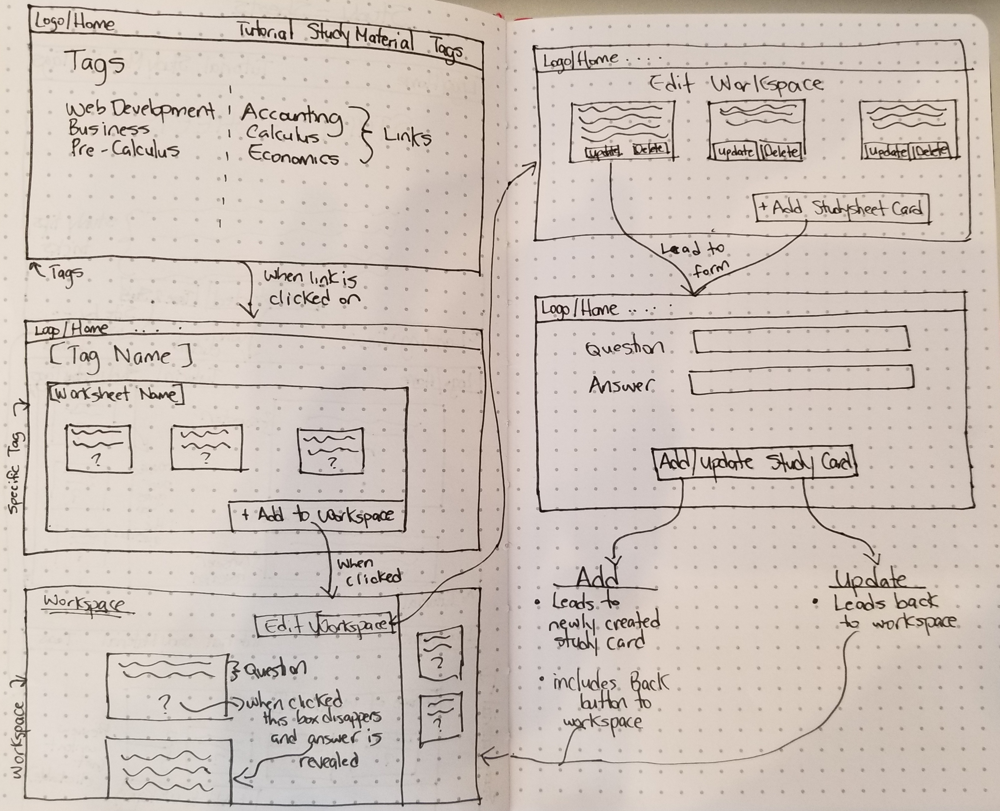

# Project Overview

## Project Description

<!-- Use this section to describe your final project and perhaps any links to relevant sites that help convey the concept and/or functionality. -->

The purpose of this app is for users to be able to study efficiently on a specific subject they are having trouble with, or to brush up on old material. Users will have access to all default worksheets and the study cards in them. Once a worksheet is added to a user's workspace they will be able to create, delete and update the study cards in that particular worksheet.

- Site Example 1: https://quizlet.com/
- Site Example 2: http://www.cram.com/

## Wireframes

<!-- Include images of your wireframes.  -->

## Database Schema

### Table Name: Worksheets
| Column Name | Data Type |
| --- | :---: |
| id | primary key |
| category_id | references Categories(id) |

### Table Name: Cards
| Column Name | Data Type |
| --- | :---: |
| id | primary key |
| worksheet_id |  references Worksheets(id) |
| option_id | references Options(id) |

### Table Name: Categories
| Column Name | Data Type |
| --- | :---: |
| id | primary key |
| category | ex) Web Development, Accounting, Business, etc. |

### Table Name: Types 
| Column Name | Data Type |
| --- | :---: |
| id | primary key |
| type_of | ex) multiple choice, short answer, etc. |

### Table Name: Options
| Column Name | Data Type |
| --- | :---: |
| id | primary key |
| card_id | references Cards(id) |
| type_id | references Types(id) |
| option | possible answers to questions |
| isTrue | boolean |

### Table Name: Users
| Column Name | Data Type |
| --- | :---: |
| id | primary key |
| question |  |
| option_id | references Options(id) |

## Priority Matrix

Include a full list of features that have been prioritized based on the `Time and Importance` Matrix. 

| Component | Priority | Estimated Time |
| --- | :---: |  :---: |
| App Logic | 1 | 10hrs| 
| Database Setup | 2 | 1hrs| 
| Routes | 3 | 3hrs| 
| Page Layout | 4 | 8hrs| 
| Page Design | 5 | 9hrs|
| Total |  | 31hrs| 

## App Components

### Landing Page
<!-- What will a user see when they start your app? -->
A user will see a welcome page that gives them tips and tricks on how to be a better learner.

### App Initialization
<!-- What will a user see when the app is started?  -->
When the app is started, users will be able to view all worksheets on the site. They can also navigate to the tutorial page that explains all actions they can do with the worksheets.

### Using The App
<!-- What will be the flow of the game, what will the user be expected to do and what will the user expect from the game. -->
Once the user has chosen a worksheet they can choose what type of questions they want. The types of questions available will be multiple choice, short answer and essay questions. They can choose a combination of the types, or choose all of them. Users will also be able to edit their workspace by creating a new study card, or updating or deleting a study card that's already available.

## MVP 

<!-- Include the full list of features that will be part of your MVP  -->
- A tutorial page will be provided to inform users on how to navigate through the site
- Users will be able to choose the type of questions they want to study, i.e, multiple choice, short answer, and essay questions
- When you click on the question mark on the study cards, the answer of the question will be revealed to the user
- Users will be able to create, update and delete study cards when they edit their workspace

## POST MVP

<!-- Include the full list of features that you are considering for POST MVP -->
- Cards will be animated to flip over.
- Logged in users will be able to create their own worksheets

## Functional Components

Based on the initial logic defined in the previous game phases section try and breakdown the logic further into functional components, and by that we mean functions.  Does your logic indicate that code could be encapsulated for the purpose of reusablility.  Once a function has been defined it can then be incorporated into a class as a method. 

Time frames are also key in the development cycle.  You have limited time to code all phases of the game.  Your estimates can then be used to evalute game possibilities based on time needed and the actual time you have before game must be submitted. 

| Component | Priority | Estimated Time | Time Invested | Actual Time |
| --- | :---: |  :---: | :---: | :---: |
| App Logic | 1 | 10hrs| 7hrs | 7hrs |
| Database Setup | 2 | 1hrs| 7hrs | 7hrs |
| Routes | 3 | 3hrs| 7hrs | 7hrs |
| Page Layout | 4 | 8hrs| 7hrs | 7hrs |
| Page Design | 5 | 9hrs| 7hrs | 7hrs |
| Post-MVP | 6 | 7hrs| 7hrs | 7hrs |
| Total |  | 38hrs| 42hrs | 42hrs |
